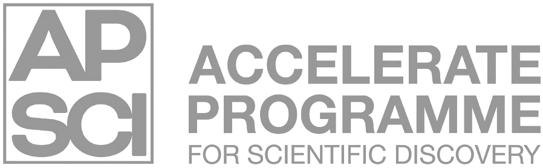

<!-- Improved compatibility of back to top link: See: https://github.com/othneildrew/Best-README-Template/pull/73 -->
<a name="readme-top"></a>

<!-- PROJECT SHIELDS -->
<!-- [![Contributors][contributors-shield]][contributors-url]
[![Forks][forks-shield]][forks-url]
[![Stargazers][stars-shield]][stars-url]
[![Issues][issues-shield]][issues-url]
[![GPL License][license-shield]][license-url] -->
[](https://opensource.org/licenses/)
[](https://github.com/acceleratescience/llms-for-pi/issues)
[](https://github.com/acceleratescience/llms-for-pi/graphs/contributors)
[](https://github.com/acceleratescience/llms-for-pi/pulls)
[](http://makeapullrequest.com)
<br>
[]()
[]()
[]()
[](https://github.com/acceleratescience)
[](https://twitter.com/AccelerateSci)
<!-- [![LinkedIn][linkedin-shield]][linkedin-url] -->


<!-- PROJECT LOGO -->
<br />
<div align="center">
  <a href="https://acceleratescience.github.io/">
    
  </a>

  <h3 align="center">LLMs for Pi</h3>

  <p align="center">
    This is the material for the LLMs for Pi workshop run for the Sutton Trust Summer School in the Computer Lab at the University of Cambridge.
  </p>
</div>


<!-- TABLE OF CONTENTS -->
<details>
  <summary>Table of Contents</summary>
  <ol>
    <li><a href="#prerequisites">Prerequisites</a></li>
    <li><a href="#setup">Setup</a></li>
    <li><a href="#part-1-the-notebook">Part 1: The notebook</a></li>
    <li><a href="#part-2-ollama">Part 2: Ollama</a></li>
    <li><a href="#contributing">Contributing</a></li>
    <li><a href="#license">License</a></li>
  </ol>
</details>

<!---------------------------------------------------------------------------->

[Button Shield]: https://img.shields.io/badge/Shield_Buttons-37a779?style=for-the-badge

[License]: LICENSE
[Shield]: Types/Shield.md
[#]: #

<!---------------------------------[ Badges ]---------------------------------->

[Badge License]: https://img.shields.io/badge/-BY_SA_4.0-ae6c18.svg?style=for-the-badge&labelColor=EF9421&logoColor=white&logo=CreativeCommons
[Badge Likes]: https://img.shields.io/github/stars/MarkedDown/Buttons?style=for-the-badge&labelColor=d0ab23&color=b0901e&logoColor=white&logo=Trustpilot

<p align="right">(<a href="#readme-top">back to top</a>)</p>


<!-- GETTING STARTED -->
## Prerequisites
This project requires only a Raspberry Pi and the ability to follow instructions.

## Setup
To get going with this project first clone the repo:

```bash
git clone https://github.com/acceleratescience/llms-for-pi.git
cd llms-for-pi
```

Now run the setup script

```bash
./setup.sh
```

To see what the script does, look in the `setup.sh` file. But in short, it will install all the necessary packages, download the `Qwen/Qwen2.5-0.5B` model, and install Ollama.

<p align="right">(<a href="#readme-top">back to top</a>)</p>

## Part 1: The notebook
In the notebook `intro-to-qwen.ipynb` you will find a walkthrough in how to get models from Hugging Face.

<p align="right">(<a href="#readme-top">back to top</a>)</p>

## Part 2: Ollama
<div align="center">
  <a href="https://acceleratescience.github.io/">
    
  </a>
</div>

In this part, we will run our model in the command line. To chat with the model, run in the command line

```bash
ollama run qwen2.5:0.5b
```

The model parameters were already downloaded during the setup stage, but to run other models, you can 

You might also be able to get away with running the 1.5B parameter model:

```bash
ollama run qwen2.5:1.5b
```

<p align="right">(<a href="#readme-top">back to top</a>)</p>

<!-- CONTRIBUTING -->
## Contributing

Contributions are what make the open source community such an amazing place to learn, inspire, and create. Any contributions you make are **greatly appreciated**.

If you have a suggestion that would make this better, please fork the repo and create a pull request. You can also simply open an issue with the tag "enhancement".
Don't forget to give the project a star! Thanks again!

1. Fork the Project
2. Create your Feature Branch (`git checkout -b feature/AmazingFeature`)
3. Commit your Changes (`git commit -m 'Add some AmazingFeature'`)
4. Push to the Branch (`git push origin feature/AmazingFeature`)
5. Open a Pull Request

<p align="right">(<a href="#readme-top">back to top</a>)</p>


<!-- LICENSE -->
## License

Distributed under the Apache 2.0 License. See `LICENSE` for more information.

<p align="right">(<a href="#readme-top">back to top</a>)</p>


<!-- MARKDOWN LINKS & IMAGES -->
<!-- https://www.markdownguide.org/basic-syntax/#reference-style-links -->
[contributors-shield]: https://img.shields.io/github/contributors/acceleratescience/llms-for-pi.svg?style=for-the-badge
[contributors-url]: https://github.com/acceleratescience/llms-for-pi/graphs/contributors
[forks-shield]: https://img.shields.io/github/forks/acceleratescience/llms-for-pi.svg?style=for-the-badge
[forks-url]: https://github.com/acceleratescience/llms-for-pi/network/members
[stars-shield]: https://img.shields.io/github/stars/acceleratescience/llms-for-pi.svg?style=for-the-badge
[stars-url]: https://github.com/acceleratescience/llms-for-pi/stargazers
[issues-shield]: https://img.shields.io/github/issues/acceleratescience/llms-for-pi.svg?style=for-the-badge
[issues-url]: https://github.com/acceleratescience/llms-for-pi/issues
[license-shield]: https://img.shields.io/github/license/acceleratescience/llms-for-pi.svg?style=for-the-badge
[license-url]: https://github.com/acceleratescience/llms-for-pi/blob/master/LICENSE.txt
[linkedin-shield]: https://img.shields.io/badge/-LinkedIn-black.svg?style=for-the-badge&logo=linkedin&colorB=555
[linkedin-url]: https://linkedin.com/company/accelerate-programme-for-scientific-discovery/
[product-screenshot]: images/screenshot.png
[Next.js]: https://img.shields.io/badge/next.js-000000?style=for-the-badge&logo=nextdotjs&logoColor=white
[Next-url]: https://nextjs.org/
[React.js]: https://img.shields.io/badge/React-20232A?style=for-the-badge&logo=react&logoColor=61DAFB
[React-url]: https://reactjs.org/
[Vue.js]: https://img.shields.io/badge/Vue.js-35495E?style=for-the-badge&logo=vuedotjs&logoColor=4FC08D
[Vue-url]: https://vuejs.org/
[Angular.io]: https://img.shields.io/badge/Angular-DD0031?style=for-the-badge&logo=angular&logoColor=white
[Angular-url]: https://angular.io/
[Svelte.dev]: https://img.shields.io/badge/Svelte-4A4A55?style=for-the-badge&logo=svelte&logoColor=FF3E00
[Svelte-url]: https://svelte.dev/
[Laravel.com]: https://img.shields.io/badge/Laravel-FF2D20?style=for-the-badge&logo=laravel&logoColor=white
[Laravel-url]: https://laravel.com
[Bootstrap.com]: https://img.shields.io/badge/Bootstrap-563D7C?style=for-the-badge&logo=bootstrap&logoColor=white
[Bootstrap-url]: https://getbootstrap.com
[JQuery.com]: https://img.shields.io/badge/jQuery-0769AD?style=for-the-badge&logo=jquery&logoColor=white
[JQuery-url]: https://jquery.com 
